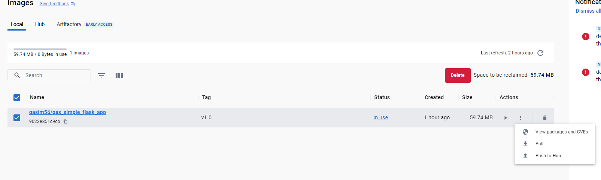

# Part 1: Docker file Creation, GitHub and Docker Hub Integration

## Identify a Sample Application.

-   Compile a python code using any compiler. I have used VS Code IDE to compile following code in ‘**app.py**’.

```
from flask import Flask
app = Flask(__name__)

@app.route('/')
def welcome():
return 'Hello, World!'
```

-   Use ‘flask run’ command in VS Code terminal for execution of **‘app.py’** code:
-   Ensure you have already installed python and Flask. Check the installation with following commands

```
python - -version

flask - -version
# To install flask use command ‘pip install flask’ in VS code terminal
```


-   Output on Screen is ‘Hello World!’ on IP 127.0.0.1:5000

    

## Dependencies

-   Flask

    For running same python and Linux would be required like **python:3.9.18-alpine3.18**)

## Creation of Docker file

-   Create a Dockerfile and requirements.txt files in VS code. Requirements.txt has the Flask version mentioned in it.
-   Install Docker Desktop and also create an account on <https://hub.docker.com>


-   Used CMD for Entry point
-   For port binding use:

docker container run -d -p 5000:5000 qasim56/qas_simple_flask_app:v1.0


## Push code to Dockerhub

<https://hub.docker.com/repository/docker/qasim56/qas_simple_flask_app/general>

-   You can use command line or Docker Desktop for same



## Create a GitHub Repository

-   Push code on Github repository: [**https://github.com/etechcrunch/Docker_repo.git**](https://github.com/etechcrunch/Docker_repo.git)
